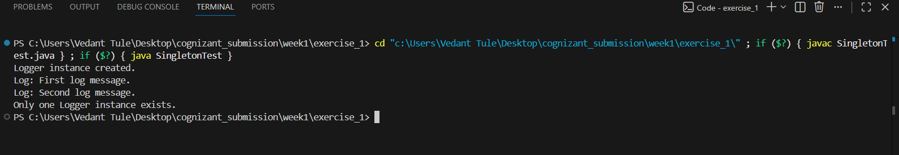
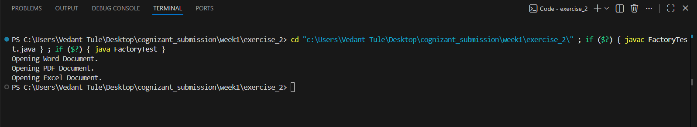
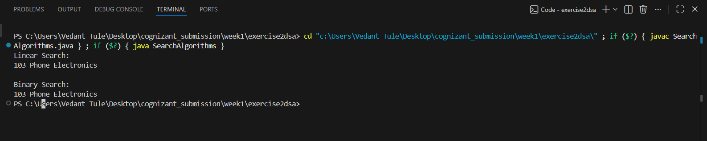
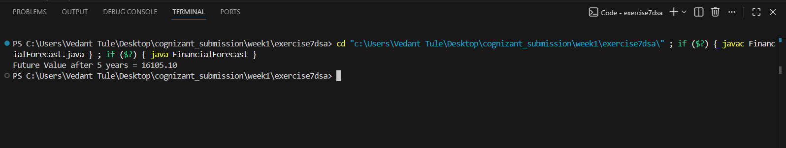
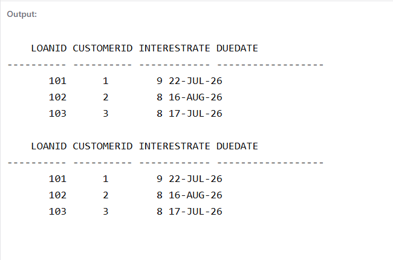
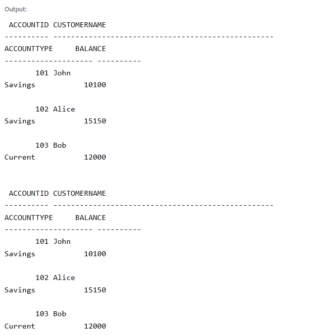

# Design Patterns and Principles

### Exercise 1: Implementing the Singleton Pattern

### Exercise 2: Implementing the Factory Method Pattern

# Data structures and Algorithms

### Exercise 2: E-commerce Platform Search Function

### Exercise 7: Financial Forecasting

# PL/SQL programming

### Exercise 1: Control Structures

### Exercise 3: Stored Procedures

